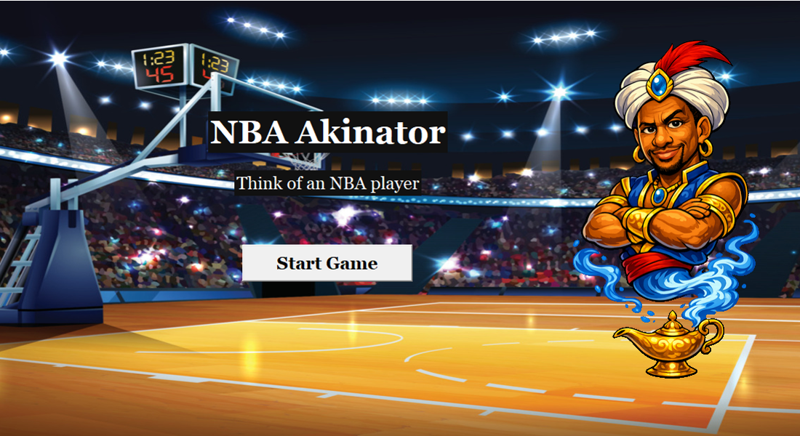
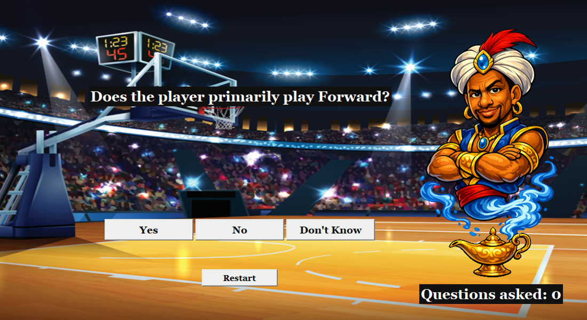
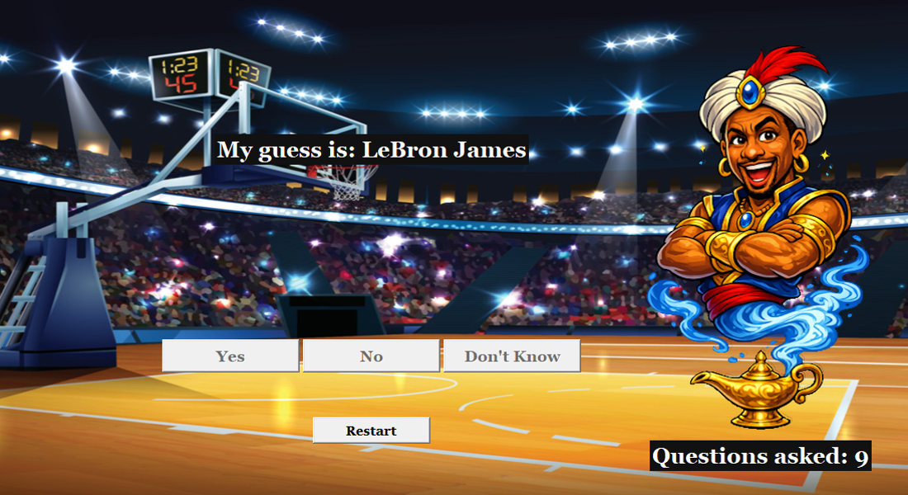

# NBA Akinator 🏀
A Python desktop game inspired by Akinator that guesses which NBA player you are thinking of by asking a series of questions about their career. 
The game uses real NBA data pulled from the NBA Stats API to generate player attributes and intelligently narrow down possible players.

## Demo
### Start Screen

### Question Screen

### Guess Screen


## Features
- 🧠 **Intelligent question selection**  
  The engine selects questions that best split the remaining players.
- 📊 **Real NBA data**  
  Player information is collected using the NBA Stats API.
- 🎨 **Dynamic UI reactions**
  - Neutral background normally
  - Happy background after multiple Yes answers
  - Mad background after multiple No answers
- 🔢 **Question counter**  
  Tracks how many questions the engine used before guessing.
- 🎯 **Fallback guessing**  
  If no remaining questions can narrow players further, the engine makes a random guess from the remaining candidates.

## Example Questions
The engine may ask questions like:
- Was the player drafted in the first round?
- Does the player primarily play Guard?
- Has the player made an All-Star team?
- Has the player ever averaged 30 PPG for a season?
- Has the player ever played in the Playoffs?

These questions progressively narrow down the player pool.

## Project Structure:
- `app.py`
- `build_dataset.py`
- `engine.py`
- `questions.py`
- `UI_Background/`
    - `background_happy.png`
    - `background_mad.png`
    - `background_neutral.png`
- `images/`
    - `guess_screen.PNG`
    - `question_screen.PNG`
    - `start_screen.PNG`
- `active_nba_players.csv` 

## Installation and Execution
### 1. Clone the Repository
```
git clone https://github.com/1linden/NBA_Akinator.git
```
### 2. Install Dependencies
```
pip install -r requirements.txt
```
### 3. Build the Player Dataset
```
python build_dataset.py
```
### 4. Run the Game
```
python app.py
```

## How the Guessing Engine Works

1. Start with all players as candidates.
2. Ask questions that best split the remaining players.
3. Remove players who are inconsistent with the user's answers.
4. Repeat the process until:
   - Only one player remains, or
   - No remaining question can further split the remaining players, so the engine makes a random guess from the remaining players.

## Technologies Used
- Python  
- Tkinter – desktop GUI  
- Pandas – dataset processing  
- NBA Stats API – player data

## License
This project is for educational purposes and is not affiliated with the NBA.
